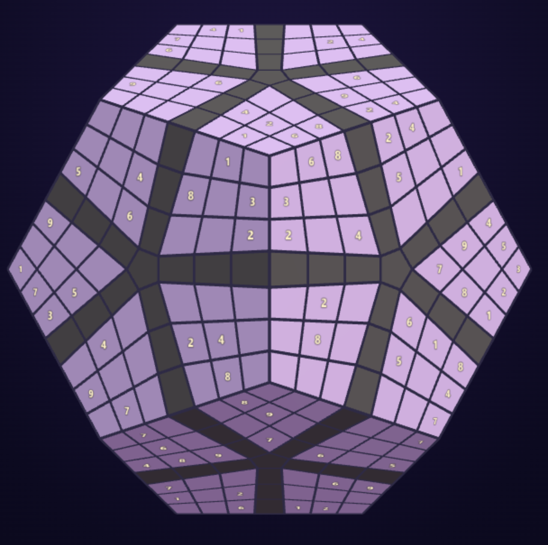

# sudosudosudo

Sudoku-style number puzzles mapped onto polyhedral twisty-puzzle cut patterns, rendered in Three.js.



## About

A single-file Three.js app (`index.html`) that lays Sudoku-style cell layouts onto the surfaces of twisty puzzles. It includes several shapes across multiple families — Cube, Tuttminx-family (Megaminx 46, Tuttminx), Megaminx-family (Teraminx, Megaminx), Kilominx, and Icosaminx — each with its own givens, sub-block grouping, and cross-piece row constraints.

## Controls

- **left-click** select a cell · **1–9** fill · **0 / ⌫** clear
- **right-drag** rotate · **scroll** zoom
- **🎲** or the seed box generate a new puzzle

## Run locally

Serve the folder with any static server, then open it in a browser:

```sh
serve.bat
```

Then open <http://localhost:8080>. Add `?seed=42` to the URL to load a specific puzzle.

## Design notes

See [design.md](design.md) for the geometry derivation and the universal shape-building recipe.
